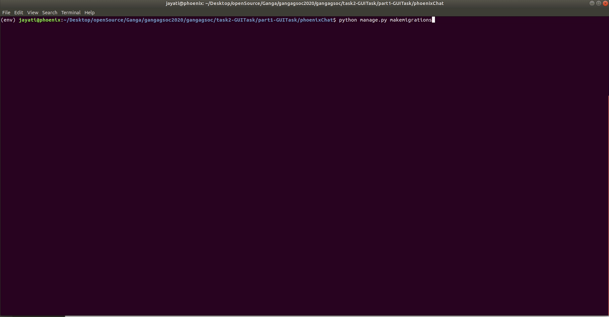
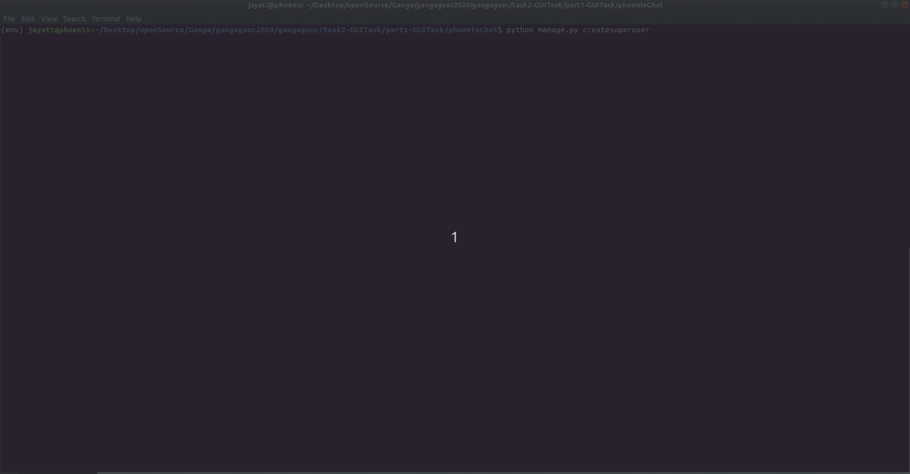
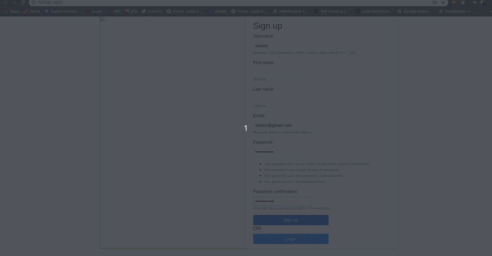

# Chat Application

I have used `django`, `django-channels`, `redis` and `django rest_framework`

Django is a web building framework based on the Python programming language. It uses a Model-View-Template(“MVT”) architecture.

Channels is a project that takes Django and extends its abilities beyond HTTP — to handle WebSockets, chat protocols, IoT protocols, and more. Channels makes an asynchronous layer in Django so that although Django runs synchronously, Channels could handle its socket asynchronously.

Redis is used to save the message in a queue before sending them. The chat application will save the messages to the database only after passing it to the other client. It uses sockets to send and receive messages between the two clients.


## Description of important files

1. `chat/consumers.py`: Allows to write synchronous or async code and deals with handoffs and threading. Structures the code as a series of functions to be called whenever an event happens, rather than making write an event loop.

2. `phoenix/routing.py`:  routing classes allow to combine and stack consumers (and any other valid ASGI application) to dispatch based on what the connection is.


## Executing the chat app


Open Terminal

1. Activate virtualenv

``` 
virtualenv --python=$(which python3) env
source env/bin/activate 
```

2. Change the directory and install the dependencies
This step is not required if you ran `pip install -e . already`
``` 
cd phoenixChat
pip install -r requirements.txt
```

3. Make migrations
``` 
python manage.py makemigrations chat
```

```
python manage.py migrate
```



4. Create a superuser. (Required to log in to admin panel)
``` 
python manage.py createsuperuser 
```

Start django development server using
``` 
python manage.py runserver 
```



5. Open http://127.0.0.1:8000/ in two different browsers or in one browser and another in incognito mode.

Create two users using the signup form


6. Select the alternative users from the list of users displayed and start chatting


**References**: [https://www.djangoproject.com/](https://www.djangoproject.com/)

[https://redis.io/topics/quickstart](https://redis.io/topics/quickstart)

[https://channels.readthedocs.io/en/latest/tutorial/](https://channels.readthedocs.io/en/latest/tutorial/)

[https://www.django-rest-framework.org/tutorial/quickstart/](https://www.django-rest-framework.org/tutorial/quickstart/)

